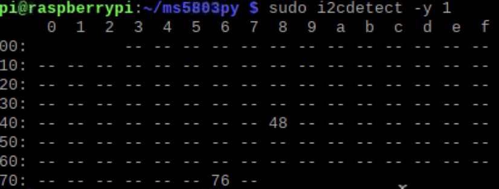
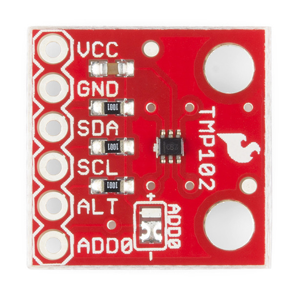

## Connect the two sensors using I2C connection
Make sure I2C is enabled on your Rpi.

Use the following command for I2C device detection:
````
sudo i2cdetect -l  
````
[]

The TMP102 has the address of  0x76  & MS5803 has the address of 0x48
# We're using ms5803 & TMP102

[](https://www.sparkfun.com/products/12909)
[](https://www.sparkfun.com/products/13314)


# TMP102
TMP102 is a tempreture and pressure sensor. For more info click on the TMP102 image above.

# MS5803
MS5803-14BA is a pressure sensor. For more info click on the MS5803 image above.

clone this repo using:
````
git clone https://github.com/Orbitalspace/Rpi-Multi-sensors-I2C.git
````
Then go to the folder directory:
````
cd ms5803andtmp102 
````
run:
````
python ms5803_and_TMP102.py
````
